# 📈 Agentic Asset Management System

A highly autonomous, end-to-end asset management architecture that fuses Agentic AI (OpenClaw) data ingestion, Python-based data engineering, and a modern React UI.

This project aims to deliver a **stable, advanced, and comfortable-to-operate** financial tracking experience.

## 🏗️ Architecture Flow

Unlike traditional dashboards that rely on manual data entry, this system is an automated pipeline:

1. **Agentic Data Ingestion (OpenClaw):** The Agent autonomously monitors, scrapes, and parses unstructured financial information (like screenshots or statements) and updates the core Google Sheets database in real-time.
2. **Data Engineering (Python):** Background scripts clean the tabular data, validate numerical integrities, and format the output into clean JSON APIs.
3. **Frontend Visualization (React):** A sleek, reactive UI that consumes the processed data to render high-fidelity charts and metrics instantly.

```mermaid
graph TD
    %% Styling
    classDef ai fill:#f3e8ff,stroke:#a855f7,stroke-width:2px,color:#6b21a8
    classDef cloud fill:#e0f2fe,stroke:#0ea5e9,stroke-width:2px,color:#0369a1
    classDef script fill:#fef9c3,stroke:#eab308,stroke-width:2px,color:#a16207
    classDef ui fill:#ecfdf5,stroke:#10b981,stroke-width:2px,color:#047857

    %% Nodes
    subgraph Ingestion["🤖 AI Data Ingestion"]
        A["OpenClaw Agent<br/>(LLM RPA)"]:::ai
        SRC1["WhatsApp/Telegram<br/>Images"]
        SRC2["PDF Bank<br/>Statements"]
        SRC1 --> A
        SRC2 --> A
    end

    subgraph Storage["☁️ Cloud Database"]
        DB[("Google Sheets<br/>(Serverless DB)")]:::cloud
    end

    subgraph Engineering["⚙️ Data Engineering"]
        P1["validate.py<br/>(Data Integrity)"]:::script
        P2["extract_data.py<br/>(JSON Serialization)"]:::script
    end

    subgraph Frontend["🎨 React Dashboard"]
        UI["High-Fidelity UI<br/>(Vite + Tailwind)"]:::ui
        CHART["Recharts<br/>(Linear Spline)"]:::ui
        UI --- CHART
    end

    %% Flow
    A -- "Real-time Update" --> DB
    DB -. "Raw Export (.xlsx)" .-> P1
    P1 -- "Clean Data" --> P2
    P2 -- "Secure JSON Payload" --> UI
```



## ✨ Demo Video


_(The data in this demo has been fully anonymized via our secure scalar engine, preserving accurate yield curves while hiding true net worth.)_

## 🌟 Key Capabilities

- **Realistic Linear Charting:** Uses `recharts` to render a highly accurate, un-smoothed historical Net Asset Value (NAV) curve, complete with an interactive X-axis timeline.
- **Dynamic Time Ranges:** Zero-latency toggles to slice data across multiple horizons (**7D**, **30D**, and **ALL**) without reloading.
- **Bone-Screen Privacy Mode:** A hardware-level secure UI toggle that masks all sensitive numerical data with an elegant `••••••` string replacement, perfect for public viewing or screen sharing.
- **Data Anonymization Engine:** A specialized Python script (`generate_demo_data.py`) scales true wealth by a secret random factor, allowing you to share your UI iterations safely.

## 🚀 Future Roadmap

Our ultimate goal is to evolve this dashboard into a comprehensive personal wealth workstation:

- **Stability & Precision:** Continuously perfect the current real-time data sync pipeline to ensure zero-downtime and 100% data fidelity.
- **Advanced UX:** Create an even more comfortable and seamless user experience.
- **Expanded Financial Tools:** Introduce lightweight utility modules (e.g., tax estimators, multi-currency conversion, portfolio rebalancing calculators) directly into the UI.

## 🛠️ Tech Stack

- **Agent Framework:** OpenClaw (LLM-driven RPA)
- **Data Layer:** Python, Pandas, Google Sheets API
- **Frontend:** React 18, Vite, Tailwind CSS, Recharts, Framer Motion

## ⚙️ Getting Started

1. Clone the repository:

   ```bash
   git clone https://github.com/zcxixixi/Asset-Management.git
   cd Asset-Management
   ```

2. Install dependencies:

   ```bash
   npm install
   ```

3. Extract demo data and start the Vite development server:
   ```bash
   python3 src/generate_demo_data.py
   npm run dev
   ```
   Navigate to `http://localhost:5173`.
